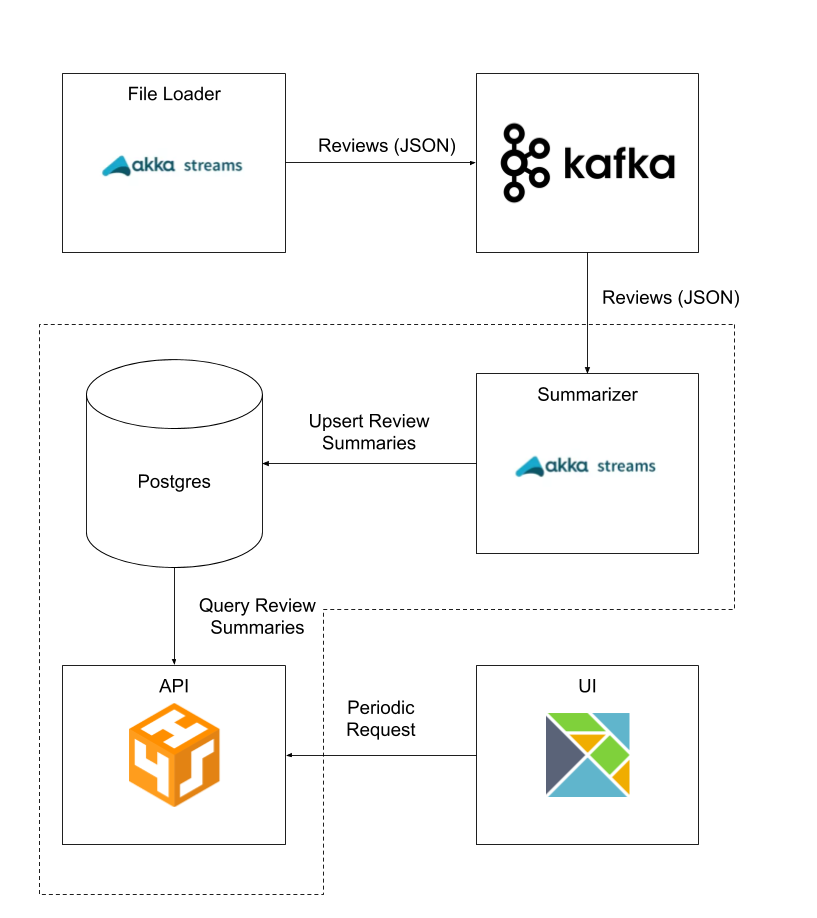

# Akka Streams Example

## Using Invoke

Install Invoke:

```
pip3 install Invoke
```

### List tasks

```
invoke --list
```

### Show help

```
invoke --help <task_name>
```

### Run all

```
invoke up
```

### Test Data

More test data can be downloaded from [here](http://jmcauley.ucsd.edu/data/amazon/).

### Overview


